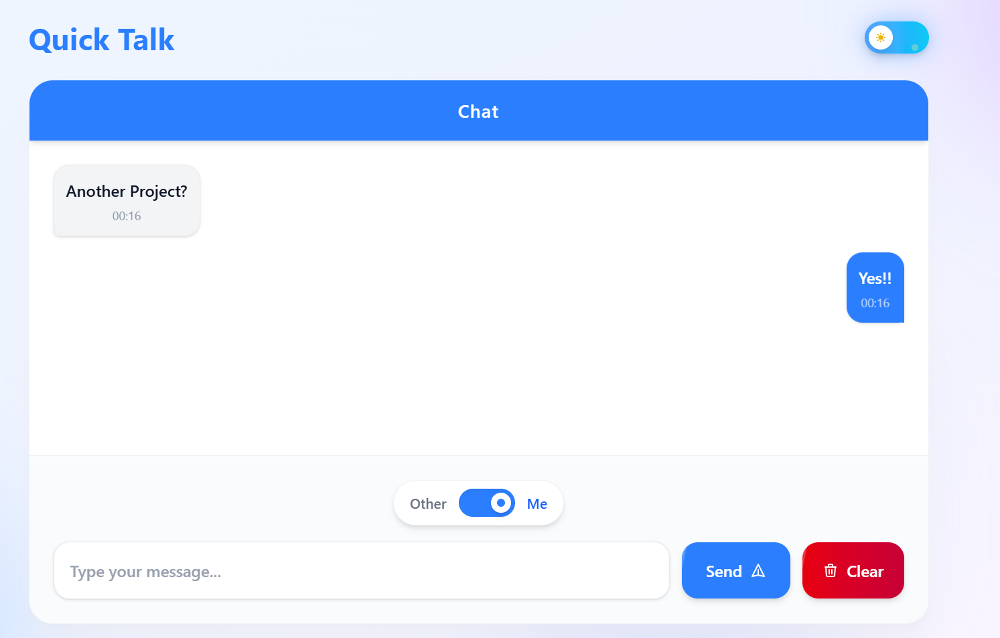
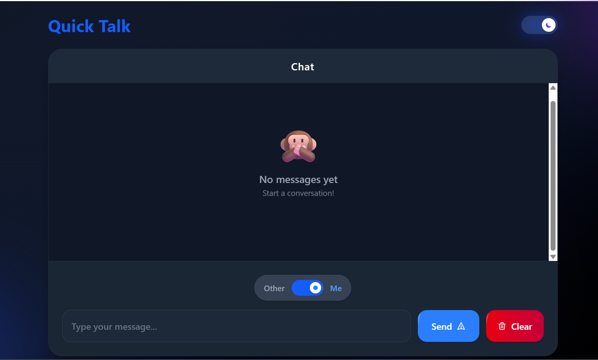

# 💬 Quick Talk

A sleek, responsive real-time chat application built with **React + TailwindCSS**.  
Supports dark/light themes, smooth animations, and a modern UI optimized for desktop and mobile.

---

## 🚀 Features
- ⚡ Real-time messaging  
- 🌗 Dark & Light theme toggle  
- 📱 Fully responsive (mobile-first)  
- 🎨 Gradient buttons, blur effects, shadows  
- ⌨️ Keyboard shortcuts (Press **Enter** to send)  
- ✨ Smooth animations & hover effects  
 

---

## 🛠️ Tech Stack
- **Frontend:** React, TailwindCSS  
- **State Management:** React hooks (useState, useEffect)  
- **Styling:** Tailwind utility classes 

---

## 📦 Installation & Setup
Clone the repo and install dependencies:

```bash
git clone https://github.com/your-username/chatapp.git
cd chatapp
npm install
npm run dev   # start dev server
```
Then open http://localhost:5173
 (or whichever port Vite shows).


## 📷 Screenshots

### Light Theme


### Dark Theme


## 🤝 Contributing

Pull requests are welcome! For major changes, open an issue first to discuss.

## 📜 License

MIT License © 2025 A23droid
